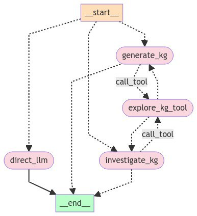

# Sumo KG
⚡ Let Sumo do the heavy lifting in creating knowledge graphs ⚡

## 🤔 What is it?
Sumo KG is a LLM-based agent that automatically creates a knowledge graph out of the information provided in a conversational way.
Sumo can investigate the created knowledge graph and answer related questions.

## 🔧 How does the agent work?
The agent autonomously decides whether to create a knowledge graph or answer related questions. In these endeavours it has the ability to call a tool for investigations. Otherwise, for non-related queries, the agent directly responds using a LLM.

## 💻 How can I use it?
Run the UI with command: `streamlit run ui.py`
